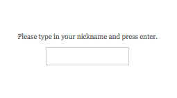
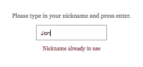
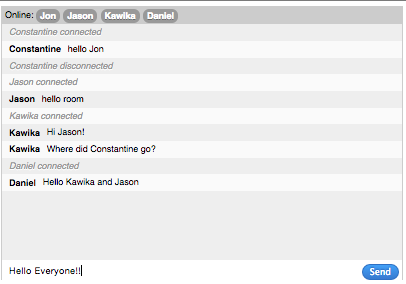

# America-Online

## Socket server and web chat client using socket.io

### Goal

Create a socket server using the [socket.io](http://socket.io) library to broadcast messages to connected clients.

Use the socket.io library.

Create a `public/` directory to store static assets that will be served up via http and used as the client to connect to your socket server. Use the [socket.io](http://socket.io) library to establish socket connections to the server, and jQuery for dom manipulation.

The browser client application is split up into 2 states:

1. nickname registration
1. chat room

When a user loads your front facing http-server using their browser, they will be prompted with a "nickname registration" screen



The user must enter in a nickname that is not blank and is not already registered on the server. Once a nickname is entered in the text field, the user can press the Return key to commit that nickname to be sent to the server. If the nickname is already registered (already exists on the server), an error message will be displayed.



If the nickname is registered successfully on the server, the "nickname registration" screen will no longer be visible, and the client application enters the "chat room" state, which has at least these 4 components.

1. List of connected users
1. Chat log containing each chat message on a new line, prepended with the author's nickname
1. Chat message text field
1. Chat send button

The user may press the Return key to also send chat messages to the server.

When the user sends a chat message, the Chat message text field will be blanked out.

When a user connects, add their nickname to the "List of connected users" and broadcast a `"[nickname] connected"` notification to the Chat log.

When a user disconnects, remove their nickname from the "List of connected users" and broadcast a `"[nickname] disconnected"` notification to the Chat log.



---

### Running the browser client app server
run `http-server` using `./public` as the webroot  
binds to default port 8080

### Running the socket server
run the socket server with `node server.js`  
binds to any available port that you specify

### Loading the browser client app
launch a web browser and navigate to `localhost:8080`

---

## Additional Features

### Mentions

If a chat message is sent with any of the words matching (case-insensitive) a connected user's nickname, that user's chat window will see this message highlighted, with their nickname also highlighted within the message.

Emit a `'mentioned'` event on the mentioned user's socket while passing an object as event argument,

```
{
  ignoredBy : [nickname],
  reason : String
}
```

### Kicking

The admin (operator who has access to the running server terminal) can kick a user by nickname. `/kick [nickname] [optional reason]`

If the user is currently connected to the server, when the kick command is executed:

1. Emit a `'kick'` event on the connected socket.
1. Broadcast a `"[nickname] was kicked"` notification to the Chat log.
1. Disconnect the socket.
1. Print a confirmation notice to the server's standard output with the nickname and the ip address of the user who has been forcefully disconnected.

Pass this object as an argument to the `'kick'` event.
```
{
  reason : String
}
```

### Rate Limiter

Prevent a single user from flooding the chat room by limiting that user's rate they can send messages. Define an internal maximum data throughput allowed per user (or per host, or for the whole server) and do not relay or broadcast messages when the limit is reached.

Broadcast a `"[nickname] has reached the allowed message limit"` notification to the Chat log.

### Auto Kick

Have a setting that will automatically kick a user from the server if they violate the allowed message sending rate `n` many times.

1. Emit a `'kick'` event on the connected socket.
1. Broadcast a `"[nickname] was auto-kicked for exceeding the rate limit"` notification to the Chat log.
1. Disconnect the socket.
1. Print a confirmation notice to the server's standard output with the nickname and the ip address of the user who has been forcefully disconnected.

Pass this object as an argument to the `'kick'` event.
```
{
  reason : String
}
```

### Ban Hammer

The admin (operator who has access to the running server terminal) can ban a user by nickname or by ip address. Print a confirmation notice to the server's standard output with the nickname and the ip address of the user who has been added to the ban list.

Banning a user by nickname also adds their ip address to the ban list.

Users who connect may not register with the nickname that has been added to the ban list.

Users who connect may not connect from an ip address that exists in the ban list.

If the user is currently connected to the server, when the ban command is executed:

1. Emit a `ban` event on the connected socket.
1. Broadcast a `"[nickname] is now banned"` notification to the Chat log.
1. Disconnect the socket.
1. Print a confirmation notice to the server's standard output with the nickname and the ip address of the user who has been forcefully disconnected.

---

The admin can unban a user by nickname or ip address.

Removing a user from the ban list by nickname also removes the associated ip address from the ban list.

1. Broadcast a `"[nickname] has been removed from ban list"` notification to the Chat log.
1. Emit an `unban` event on the connected socket.
1. Print a confirmation notice to the server's standard output with the nickname (if used) and the ip address of the user who has been forcefully disconnected.

### Private Messaging

A connected user can send a private message to another user by sending a custom command `/pm [recipient's nickname] [message to send]`.

If the recipient's nickname exists in the currently connected users list, emit a `'private message'` event on the recipient's socket while passing an object as event argument,

```
{
  sender : [nickname],
  messsage : String
}
```

Only the recipient will see a new message added to the Chat Log with indications that the message is a private one, and who the sender is.

If the recipient's nickname does not exist in the currently connected users list, print a helpful error message to the Chat Log.

### Blocking

A connected user can send a custom command `/block [offending nickname] [optional reason]`.

The offending nickname will be added to the user's list of blocked nicknames.

The user who issued this command will no longer be a valid recipient for private messages from a user with the offending nickname.

If the recipient's nickname exists in the currently connected users list, emit a `'blocked'` event on the offending nickname's socket while passing an object as event argument,

```
{
  blockedBy : [nickname],
  reason : String
}
```

Broadcast a `"[offending nickname] has been blocked by [nickname] : [reason]"` notification to the Chat log.

---

A connected user can unblock a blocked nickname with `/block [offending nickname] [optional reason]`

The offending nickname will be removed from the user's block list.

If the recipient's nickname exists in the currently connected users list, emit a `'unblocked'` event on the offending nickname's socket while passing an object as event argument,

```
{
  unblockedBy : [nickname],
  reason : String
}
```

Broadcast a `"[offending nickname] has been unblocked by [nickname] : [reason]"` notification to the Chat log.

### Ignoring

A connected user can send a custom command `/ignore [offending nickname] [optional reason]`.

The offending nickname will be added to the user's list of ignored nicknames.

The user who issued this command will no longer be a recipient of messages broadcasted by any user with a nickname in the ignored list.

note: not only should the user not see these messages in the Chat Log, the user should not receive any transmissions from the server for which the originator is an ignored user.

If the recipient's nickname exists in the currently connected users list, emit a `'ignored'` event on the offending nickname's socket while passing an object as event argument,

```
{
  ignoredBy : [nickname],
  reason : String
}
```

Broadcast a `"[offending nickname] has been ignored by [nickname] : [reason]"` notification to the Chat log.

---

A connected user can unignore a blocked nickname with `/unignore [offending nickname] [optional reason]`

The offending nickname will be removed from the user's ignore list.

If the recipient's nickname exists in the currently connected users list, emit a `'unignored'` event on the offending nickname's socket while passing an object as event argument,

```
{
  unignoredBy : [nickname],
  reason : String
}
```

Broadcast a `"[offending nickname] has been unignored by [nickname] : [reason]"` notification to the Chat log.

### Time stamps

Add (human readable, pretty formatted) timestamps to each Chat Log entry.
